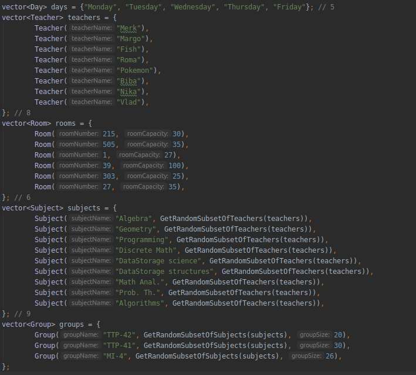
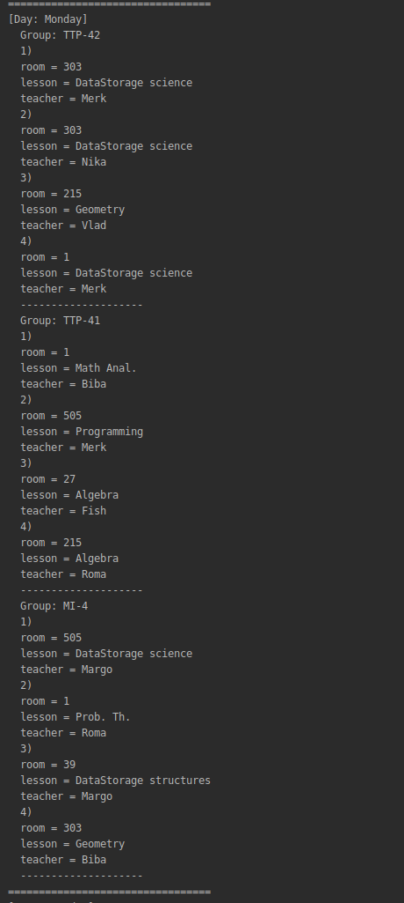
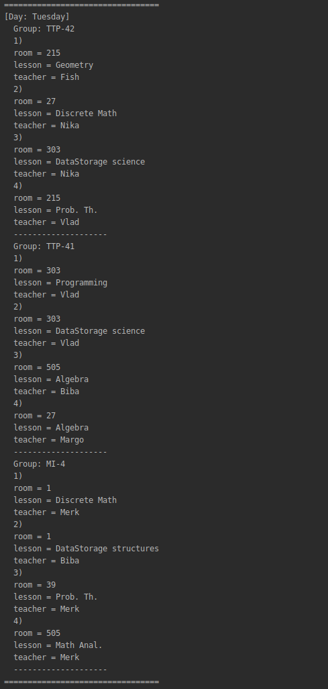

# genetic-schedule
Example of using a genetic algorithm for lecturing schedule optimization on C++.

### Input:
Here is an example of input:
- days of the week
- teachers with their names
- rooms with room number and capacity of the room
- subjects, with name and teacher who could teach them (generating randomly)
- and groups, with name, size of the group and list of subjects which they could learn



### Parameters of genetic algorithm:
```cpp
const double MUTATION_RATE = 0.02;
const size_t POPULATION_SIZE = 50;
const size_t EVOLUTION_MAX_ITERATIONS = 5000000;
```

### Example of the output:

The output is consist of number of evolve iterations and the generated schedule.

Example of the part of the generated output:

Monday                        |  Tuesday
:----------------------------:|:---------------------------------:
 |  

